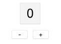

# MikMak Frontend Challenge

Within this repo, there are two simple "Counter" apps: `./react/template.js` and `./vue/template.js`. These files do not need a webserver to run - you can open them directly in the browser. All dependencies are checked in to the repo.

These two files provide a simple page with two buttons which increment and decrement a counter. A screenshot of the app is below.

### Instructions
---

#### 1. Fork, then clone this repo

Create your own fork of this repo, which you can make commits to. Clone it on your machine.

#### 2. Choose a framework

Use the `template.js` in either the `react` or `vue` directory as a starting point. Continue to step 3 and complete it using either React or Vue. 

#### 3. Complete one of the following tasks

Convert your `template.js` files to complete one of the following tasks:

* __Fibonacci__

   Create an app that increments a number (starting with 1), to the next number in the Fibonacci sequence. When someone opens this file, they should see a number, and one button  [next number]. Clicking this button should increment the number to the next integer in the Fibonacci sequence.  

* __Stopwatch__

   Create a stopwatch app in the style of the Counter app. This app should display a number, initialized to 00:00:00. It should display two buttons, [start/stop], which starts and stops the stopwatch from incrementing, and [reset], which starts the clock over from the beginning. 

* __Carousel__

   Create an image carousel. This simple app should feature an image, along with two buttons [<] and [>], which cause the image to change the the previous or next, respectively. Refer to this [W3 Schools](https://www.w3schools.com/howto/howto_js_slideshow.asp) link if this task seems ambiguous. 
  
   
### Notes

* Feel free to add styles and comments to your solution as you see fit. 
* Expectation is that this challenge will take a few hours at most, and can be completed within 5 business days after receiving it. 
* Commit your changes to the master branch of your forked repo.
* Let adam@mikmak.tv know when you're finished, or if you have any questions!